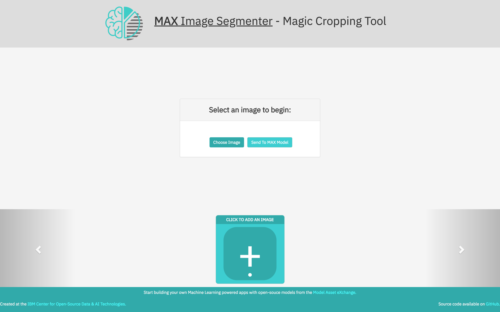
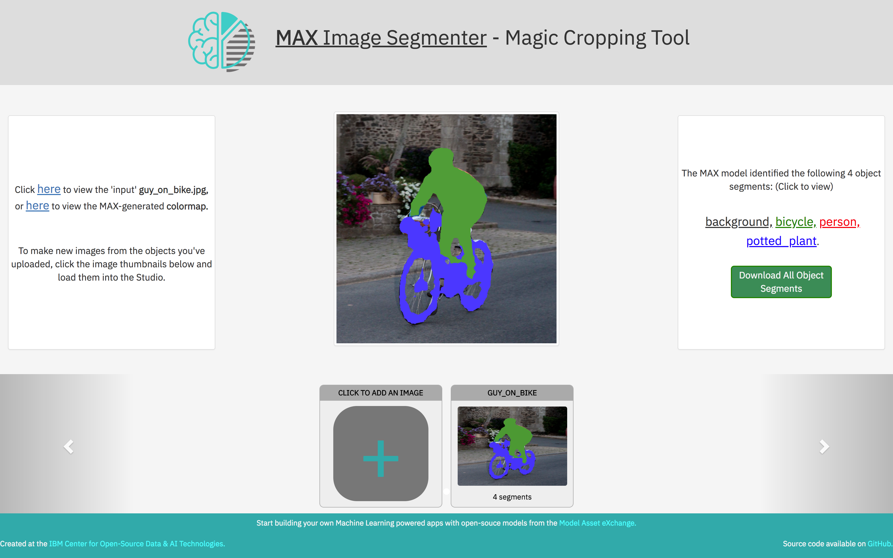
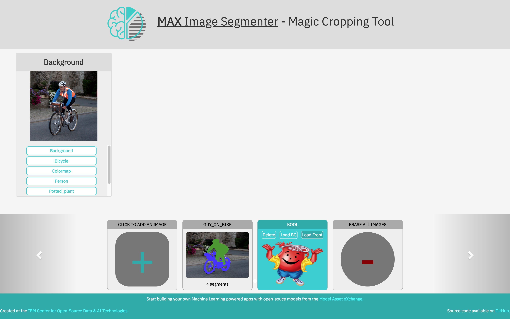
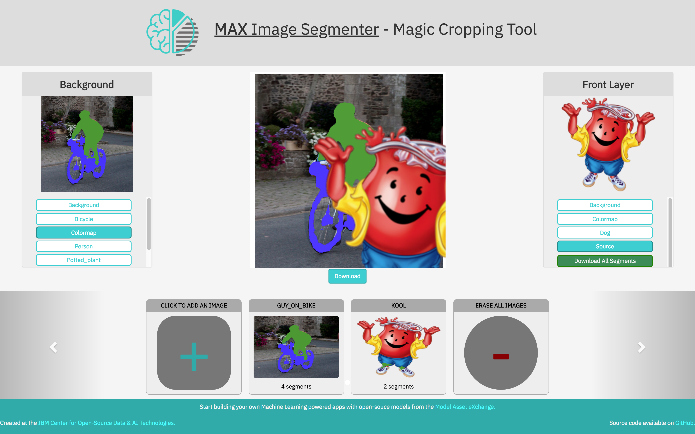

# MAX Image Segmenter Web App: Magic Cropping Tool

## Step 1: Start the MAX Image Segmenter Model API Server

This app leverages the API server included with the MAX Image Segmenter model located [here](https://github.com/IBM/MAX-Image-Segmenter). 

The official docs recommend using [Docker](https://docs.docker.com/) to run the MAX model server on your machine, which is also the recommended method to build and run this app. See the [Docker install docs](https://docs.docker.com/install/) for more information about installing Docker on your machine.

Once the required steps have been completed to install Docker, use the following command to run the model:  
`docker run -it -p 5000:5000 -e CORS_ENABLE=true kastentx/cors-max-imgseg`  
_(custom MAX Model image being used pending merge of [PR #14] (https://github.com/IBM/MAX-Image-Segmenter/pull/14) & docker image rebuild)_ 

Once Docker downloads the image and starts the container, you should see logging info in the terminal indicating that the server is `Running on http://0.0.0.0:5000/`, among other things. 

Leave this terminal open, with the model server running, and continue with the folllowing steps in a new terminal window.

## Step 2: Start the Web App

### Option 1: Build/Run the app locally with `npm`

* First, clone this repo.
* Then, `cd` into the new directory. 
* Install dependencies with the command `npm install`
* Rename the environment file with `mv sample.env .env` (and populate any blank values if running with a MAX model deployed to K8s)
* Start the app with `npm start`

Open your browser and navigate to `http://localhost:3000` to run the app, 
or `http://localhost:5000` to view the MAX model's API documentation.

### Option 2: Build/Run with Docker

* Simply run the Magic Cropping Tool container with the command  
`docker run -it -p 3000:3000 kastentx/magic-cropping-tool`   
_(development-use image)_

Open your browser and navigate to `http://localhost:3000` to run the app, 
or `http://localhost:5000` to view the MAX model's API documentation.

#### To Stop

This command will stop all running containers.  
`docker kill $(docker ps -aq)`

To remove the containers from your system, use the similar command from the section above. See the [Docker docs](https://docs.docker.com/) for more information about removing images and containers that you've accumulated. 

#### Troubleshooting

If you receive errors about ports being in use, check to make sure nothing else is already using ports `5000` or `4444` which are needed by this app. To make sure the containers aren't already running, use the command `docker ps` to list all running containers.

## Alternative Install Option: Build/Run MAX Model + Web App in one step with Docker-Compose

* First, download the configuriation file from a terminal window with the command  
  `curl https://raw.githubusercontent.com/IBM/MAX-ImgSeg-Magic-Cropping-Tool/downloads/docker-compose.yml > docker-compose.yml`

* Then, in the same directory as this file you've just downloaded, use the following command to build and run the containers with [docker-compose](https://docs.docker.com/compose/).
`docker-compose up -d --build`

Open your browser and navigate to `http://localhost:3000` to run the app, 
or `http://localhost:5000` to view the MAX model's API documentation.

### To Stop

This command will stop both the front-end app and the Model's API service.
`docker-compose stop`

### Troubleshooting

If you receive an error about duplicate containers or container names already being in use, or you just want to get rid of all saved containers use the command:
`docker rm $(docker ps -aq)`

#### Uploading Images

#### MAX Image Segmenter Response

#### Loading Images into the Studio

#### Creating Images with Saved Objects in Studio

<b>DEMO VIDEO</b>    
<i>in development</i>

