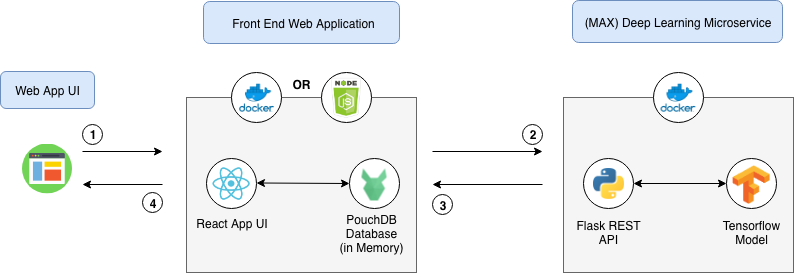
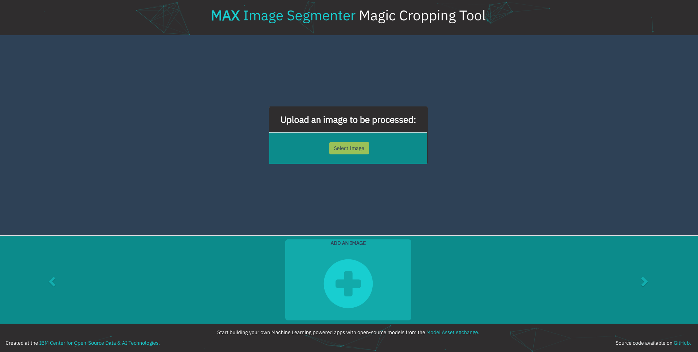
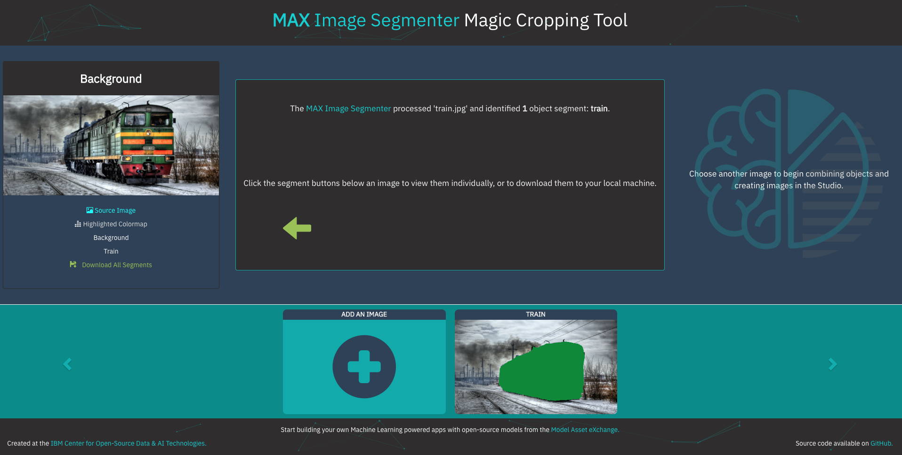
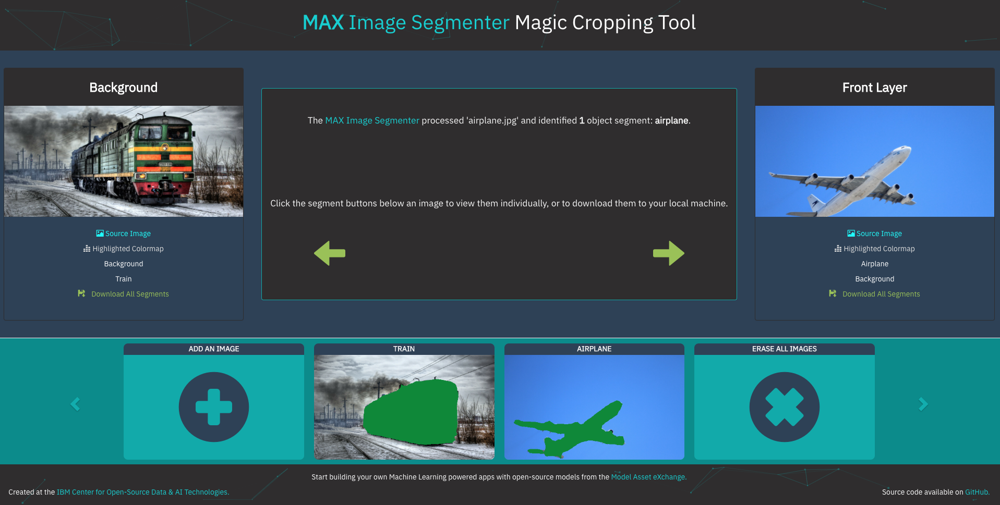
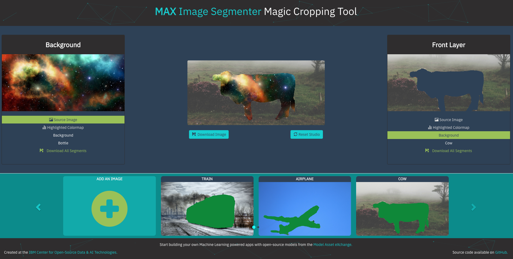

[](https://travis-ci.org/IBM/MAX-Image-Segmenter-Web-App)

# MAX Image Segmenter Web App: Magic Cropping Tool

Most images that are shared online depict one or many objects, usually in some setting or against some kind of backdrop. When editing images, it can take considerable time and effort to crop these individual objects out, whether they are to be processed further elsewhere or used in some new composition. This application uses a Deep Learning model from the [Model Asset eXchange (MAX)](https://developer.ibm.com/code/exchanges/models/) to automate this process and spark creativity.

In this application, the [MAX Image Segmenter](https://github.com/IBM/MAX-Image-Segmenter) model is used to identify the objects in a user-submitted image on a pixel-by-pixel level. These categorized pixels are then used to generate a version of the image with each unique type of object highlighted in a separate color, called a colormap. Each segment is then split into its own image file which can be downloaded for use elsewhere. As subsequent images are uploaded, they will be added to the carousel in the lower portion of the screen and saved in the browser, using PouchDB. From this carousel, images can be reviewed, deleted, or loaded into the "Studio".

In the Studio section of the app, two images may be loaded into an interface that allows for drag-and-drop combinations of any two objects within them. Any new images you may happen to create here can also be downloaded.

When the reader has completed this Code Pattern, they will understand how to:

* Deploy a deep learning model with a REST endpoint
* Recognize object segments in an image using the MAX Model's REST API
* Run a web application that uses the model's REST API
* Interact with processed object segments to create new images



# Flow

1. User submits an image using the Web App UI
2. MAX Deep Learning Microservice identifies object segments in the image and returns a JSON response
3. Web App Server uses JSON response to crop objects from image and display them to user
4. User interacts with object segments from uploaded images using Web App UI

## Included Components

* [IBM Model Asset Exchange](https://developer.ibm.com/code/exchanges/models/): A place for developers to find and use free and open source deep learning models.
* [Docker](https://www.docker.com): Docker is a tool designed to make it easier to create, deploy, and run applications by using containers.
* [React](https://reactjs.org/): An open source JavaScript library for building user interfaces.
* [PouchDB](https://pouchdb.com/): An open-source JavaScript database inspired by Apache CouchDB that is designed to run well within the browser.

## Featured Technologies

* [Node.js](https://nodejs.org/): An open-source JavaScript run-time environment for executing server-side JavaScript code.
* [Python](https://www.python.org/): Python is a programming language that lets you work more quickly and integrate your systems more effectively.

# Watch the Video

[](https://www.youtube.com/watch?v=NK6CaRGm610)

# Steps

## Run Locally

**Step 1: Start the MAX Microservice**
* [Start the Microservice](#1-start-the-microservice)
* [Experiment with the API (Optional)](#2-experiment-with-the-api-optional)

**Step 2: Start the Web App**

* [Option 1: Run the App with `npm`](#option-1-run-the-app-with-npm)
* [Option 2: Run the App with Docker](#option-2-run-the-app-with-docker)

**Alternate Install Methods**

* [Build/Run MAX Model + Web App in One Step with Docker-Compose](#buildrun-max-model--web-app-in-one-step-with-docker-compose)

### Step 1: Start the MAX Microservice

> NOTE: The set of instructions in this section are a modified version of the ones found in the [MAX Image Segmenter Model GitHub repo](https://github.com/IBM/MAX-Image-Segmenter)

This app leverages the API server included with the MAX Image Segmenter model.
The MAX microservice uses [Docker](https://docs.docker.com/) to run on your machine, which is also the recommended method to build and run this app.
See the [Docker install docs](https://docs.docker.com/install/) for more information.

#### 1. Start the Microservice

Use the following command to start the MAX microservice:
```bash
$ docker run -it -p 5000:5000 -e CORS_ENABLE=true codait/max-image-segmenter
```

Leave this window open and perform the following steps in a new terminal window.

#### 2. Experiment with the API (Optional)

The microservice automatically generates an interactive Swagger API documentation page.
Go to `http://localhost:5000` to load it. From there you can explore the API and also create test requests.

### Step 2: Start the Web App

#### Option 1: Run the App with `npm`

First, clone this repo with the command:
```bash
$ git clone https://github.com/IBM/MAX-Image-Segmenter-Web-App.git
$ cd MAX-Image-Segmenter-Web-App
```

Install dependencies with the command:
```bash
$ npm install
```

Finally, start the app with:
```bash
$ npm start
```

Open your browser and navigate to `http://localhost:3000` to view the app.

#### Option 2: Run the App with Docker

Start the app with the command:
```bash
$ docker run -it -p 3000:3000 codait/max-image-segmenter-web-app
```

Open your browser and navigate to `http://localhost:3000` to view the app.

**To Stop**

This command will stop all running containers:
```bash
$ docker kill $(docker ps -aq)
```

See the [Docker docs](https://docs.docker.com/) for more information about removing images and containers that you've accumulated.

### Alternate Install Methods

#### Build/Run MAX Model + Web App in One Step with Docker-Compose

First, download the configuration file with the following command:
```bash
$ curl https://raw.githubusercontent.com/IBM/MAX-Image-Segmenter-Web-App/master/docker-compose.yml > docker-compose.yml
```

Then, in the same directory run the MAX Model and Web App with [docker-compose](https://docs.docker.com/compose/) using the following command:
```bash
$ docker-compose up -d
```

Open your browser and navigate to `http://localhost:3000` to view the app,
or `http://localhost:5000` to view the MAX Model API documentation.

**To Stop**

Stop the Web App and MAX Microservice with the following command:
```bash
$ docker-compose stop
```

# Sample Output

* [Starting the App](#starting-the-app)
* [Uploading Images](#uploading-images)
* [MAX Image Segmenter Response](#max-image-segmenter-response)
* [Loading Images into the Studio](#loading-images-into-the-studio)
* [Combining Objects to Create New Images](#combining-objects-to-create-new-images)

#### Starting the App

This is the screen you will see upon first starting the app. Click "Add an Image" in the lower part of the screen to begin.


#### Uploading Images

From this view, click the "Select Image" button to process an image from your device.



#### MAX Image Segmenter Response

The first image to be added will be displayed on the left side of the screen, with a short description in the center.



As subsequent images are added, they will appear on the right side of the screen.



#### Loading Images into the Studio

Once you have multiple images available in the carousel, you may load them into either position in the studio through the buttons pictured above. Click an image to display its control panel.


#### Combining Objects to Create New Images

Once two images have been loaded into the Studio, click to select an Object Segment from the list below each image, then drag them around the canvas to create something new! You can download the current image or reset the studio at any time using the buttons below.


Use the provided sample images in the `/assets` folder or supply your own to see what kinds of creations you can come up with. Here's an example using a 'background' segment in the front layer with an outer-space background layer.



# Troubleshooting

- If you receive errors about ports being in use, check to make sure nothing else is already using ports `5000` or `3000` which are needed by this app. To make sure the containers aren't already running, use the command `docker ps` to list all running containers.

- If you receive an error about duplicate containers or container names already being in use, or you just want to get rid of all saved containers use the command:
  ```bash
  $ docker rm $(docker ps -aq)
  ```

- If you see the following error on `npm install` then your default python version is 3.x.x but python 2.7 is required for the `gyp` library.
  ```
  gyp ERR! stack Error: Command failed: python -c import sys; print "%s.%s.%s" % sys.version_info[:3];
  ```
  To solve this make sure you also have python 2.7 installed and run the following command to point `gyp` to python2.7
  ```
  $ npm config set python /path/to/executable/python2.7
  ```

# Links

* [Model Asset eXchange (MAX)](https://developer.ibm.com/code/exchanges/models/)
* [Center for Open-Source Data & AI Technologies (CODAIT)](https://developer.ibm.com/code/open/centers/codait/)

# Learn More

* **Artificial Intelligence Code Patterns**: Enjoyed this Code Pattern? Check out our other
[Artificial Intelligence Code Patterns](https://developer.ibm.com/code/technologies/artificial-intelligence/)
* **AI and Data Code Pattern Playlist**: Bookmark our
[playlist](https://www.youtube.com/playlist?list=PLzUbsvIyrNfknNewObx5N7uGZ5FKH0Fde) with all of our Code Pattern videos
* **Watson Studio**: Master the art of data science with IBM's [Watson Studio](https://dataplatform.ibm.com/)
* **Deep Learning with Watson Studio**: Design and deploy deep learning models using neural networks, easily scale to
hundreds of training runs. Learn more at [Deep Learning with Watson Studio](https://www.ibm.com/cloud/deep-learning).

# License
This code pattern is licensed under the Apache Software License, Version 2.  Separate third party code objects invoked within this code pattern are licensed by their respective providers pursuant to their own separate licenses. Contributions are subject to the [Developer Certificate of Origin, Version 1.1 (DCO)](https://developercertificate.org/) and the [Apache Software License, Version 2](http://www.apache.org/licenses/LICENSE-2.0.txt).

[Apache Software License (ASL) FAQ](http://www.apache.org/foundation/license-faq.html#WhatDoesItMEAN)
