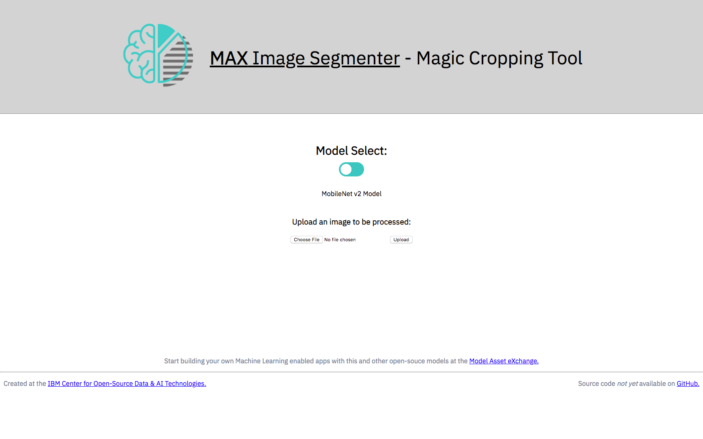
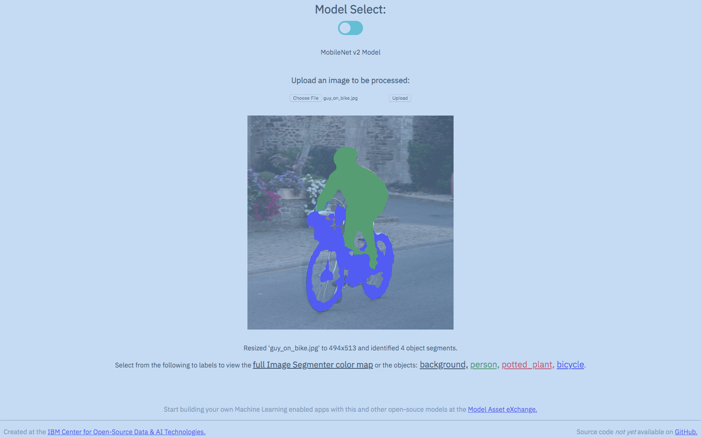

# sample front end for max-image-segmenter 

## To Install

First, clone this repo.
`git clone https://github.com/kastentx/MAX-ImgSeg-Magic-Cropping-Tool.git`

Then, enter the newly created directory for the app.
`cd MAX-ImgSeg-Magic-Cropping-Tool`

Finally, build and run the containers with [docker-compose](https://docs.docker.com/compose/).
`docker-compose up -d --build`

Open your browser and navigate to `http://localhost:3000` to see the app, 
or `http://localhost:5000` to view the MAX model's API documentation.

### To Stop

This command will stop both the front-end app and the Model's API service.
`docker-compose stop`

#### Troubleshooting

If you receive an error about duplicate containers, or you just want to get rid of all saved containers:
`docker rm $(docker ps -aq)`

